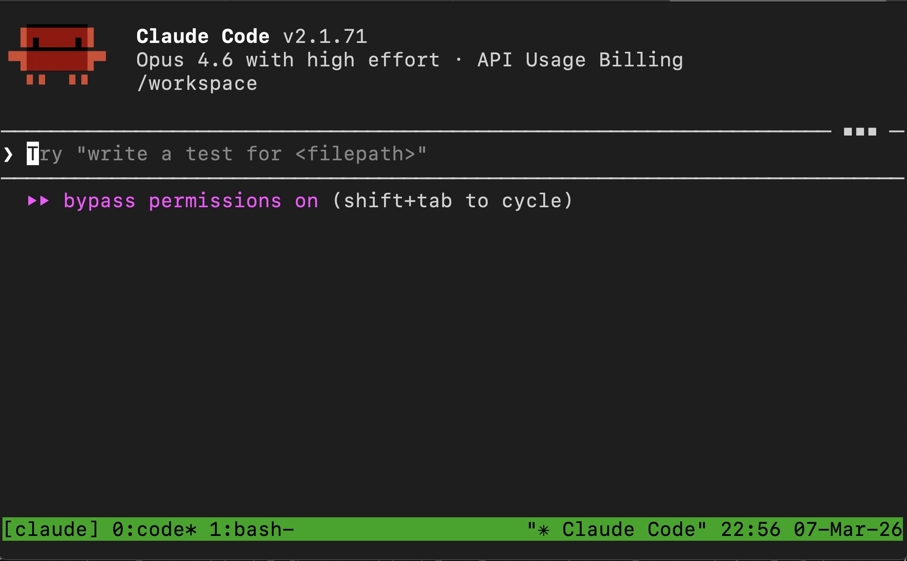
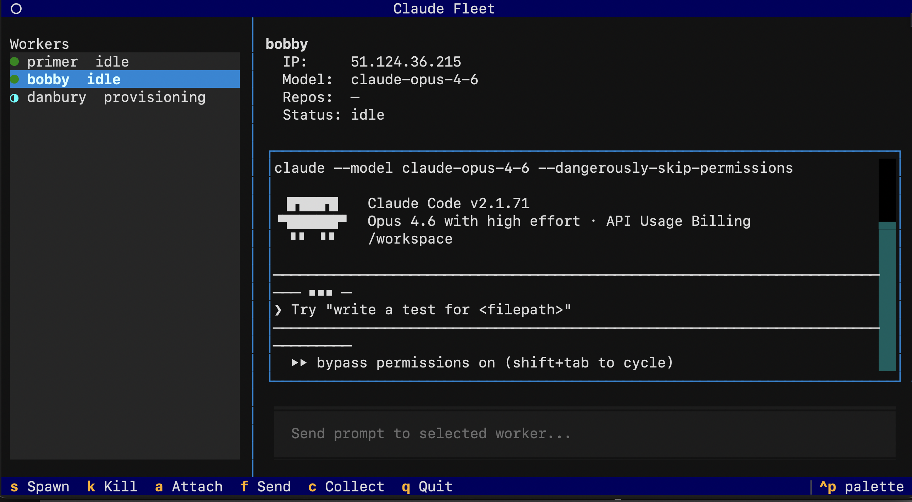
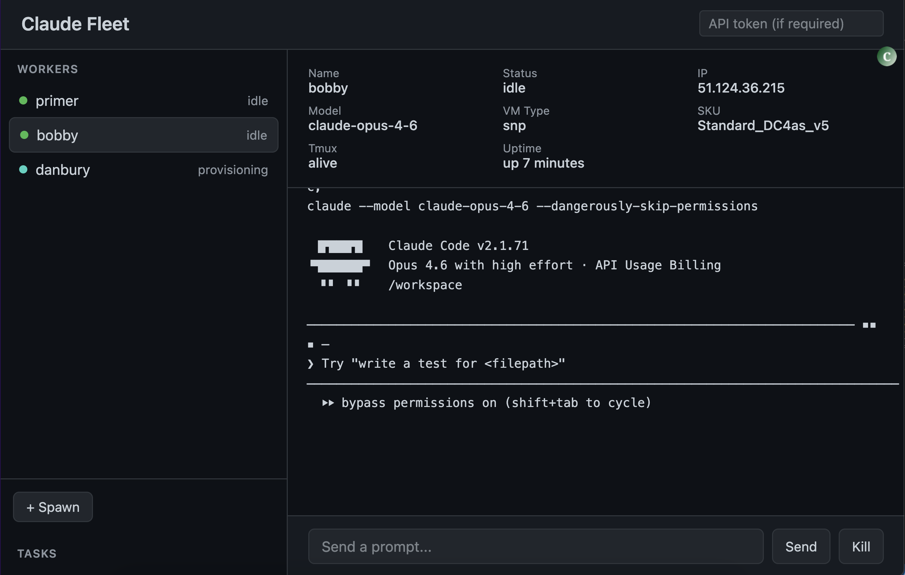

# Claude Fleet

CLI for orchestrating long-running Claude Code instances on cloud VMs. Spawn workers on Azure or GCP, send prompts, stream logs, collect results — all over SSH + tmux + rsync.

## Prerequisites

### Required

| Tool | Version | Install | Purpose |
|------|---------|---------|---------|
| Python | 3.11+ | [python.org](https://www.python.org/downloads/) | Runtime |
| Pulumi CLI | 3.x | `brew install pulumi` or [pulumi.com/docs/install](https://www.pulumi.com/docs/install/) | Infrastructure management |
| SSH key | — | `ssh-keygen -t ed25519` | VM access |
| rsync | — | Pre-installed on macOS/Linux | File transfer |
| Ansible | 2.15+ | Installed as dependency | VM provisioning |

### Cloud provider CLIs (install the ones you need)

| Provider | CLI | Install | Auth |
|----------|-----|---------|------|
| **Azure** | `az` | `brew install azure-cli` or [docs](https://learn.microsoft.com/en-us/cli/azure/install-azure-cli) | `az login` |
| **GCP** | `gcloud` | `brew install google-cloud-sdk` or [docs](https://cloud.google.com/sdk/docs/install) | `gcloud auth login && gcloud auth application-default login` |

### GCP-specific setup

- Enable the Compute Engine API: `gcloud services enable compute.googleapis.com`
- Your account needs permissions to create VMs, networks, and firewalls

### Azure-specific setup

- Get your subscription ID: `az account show --query id -o tsv`
- Your account needs permissions to create VMs, networking, and resource groups

## Install

```bash
# With uv (recommended)
git clone https://github.com/AmeanAsad/claude-fleet.git
cd claude-fleet
uv sync
uv run cfleet --help

# With pip
git clone https://github.com/AmeanAsad/claude-fleet.git
cd claude-fleet
pip install -e .
```

## Quickstart

```bash
# 1. Configure — add your Anthropic API key and cloud provider details
cp fleet.yml.example fleet.yml
nano fleet.yml

# 2. Initialize — creates ~/.cfleet/ config dir and Pulumi stack
cfleet init

# 3. Spawn a worker VM
cfleet spawn dev

# 4. Send it a task
cfleet ask dev "Set up a FastAPI project with auth, tests, and Docker"

# 5. Watch it work
cfleet logs dev -f

# 6. Jump in interactively (Ctrl+B d to detach)
cfleet attach dev

# 7. Pull results back to your machine
cfleet collect dev ./output

# 8. Tear it down when done
cfleet kill dev
```

## Multi-provider support

Both Azure and GCP can be configured simultaneously. Set a default provider in config and override per-worker:

```bash
# Uses default provider from config
cfleet spawn worker1

# Override provider for this worker
cfleet spawn worker2 --provider gcp

# Mix providers freely
cfleet spawn worker3 -p gcp --type snp    # GCP confidential VM (AMD SEV-SNP)
cfleet spawn worker4 -p azure --type tdx   # Azure confidential VM (Intel TDX)
```

### fleet.yml example

```yaml
anthropic_api_key: "sk-ant-..."

cloud:
  provider: azure           # default provider
  azure:
    subscription_id: "your-azure-subscription-id"
  gcp:
    project_id: "your-gcp-project-id"
```

### Default instance types

| Provider | regular | snp (AMD SEV-SNP) | tdx (Intel TDX) |
|----------|---------|---------------------|-----------------|
| **Azure** | Standard_D2s_v5 | Standard_DC4as_v5 | Standard_DC4es_v6 |
| **GCP** | e2-standard-2 | n2d-standard-2 | c3-standard-4 |

## Lifecycle

### 1. Initialize

```bash
cp fleet.yml.example fleet.yml
# Add your Anthropic API key and cloud provider details
cfleet init
```

This creates `~/.cfleet/` with your config, secrets, and a Pulumi stack. If you skip `fleet.yml`, `init` will prompt interactively.

### 2. Spawn workers

```bash
cfleet spawn my-worker
```

This provisions a cloud VM, installs Claude Code, clones your repos, and starts a tmux session. The worker is ready when status shows `idle`.

Options:

```bash
cfleet spawn my-worker \
  --provider gcp \                       # azure | gcp (default: config value)
  --type snp \                           # regular | snp | tdx (confidential VMs)
  --model claude-opus-4-6 \              # override default model
  --instance-type n2d-standard-4 \       # override machine type/SKU
  --repo myapp --repo infra \            # specific repos (default: all from config)
  --region us-east1-b                    # override default region/zone
```

### 3. Send prompts

```bash
cfleet ask my-worker "Build an OAuth login flow for the API"
```

Fire and forget — the worker picks up the prompt and starts working. Check progress with `ls` or `logs`.

### 4. Monitor

```bash
cfleet ls                    # List all workers with status
cfleet status my-worker      # Detailed info (IP, uptime, tmux state)
cfleet logs my-worker        # Last 100 lines of tmux output
cfleet logs my-worker -f     # Stream logs continuously
```

### 5. Interact directly

```bash
cfleet attach my-worker      # SSH into the worker's tmux session (Ctrl+B d to detach)
```

<p align="center">
  
</p>

### 6. Transfer files

```bash
cfleet send my-worker ./local-dir         # rsync files to /workspace/inbox/
cfleet collect my-worker ./output          # rsync /workspace/outbox/ to local
```

### 7. Tear down

```bash
cfleet kill my-worker                     # Destroy a single worker
cfleet kill --all                         # Destroy all workers
cfleet kill my-worker --collect ./backup  # Collect files before destroying
```

## TUI

```bash
cfleet tui
```

Three-panel interactive terminal UI. Select workers from the left, view detail and live logs on the right, send prompts from the bottom input bar.

Keybindings: **s** spawn, **k** kill, **a** attach, **f** send files, **c** collect, **q** quit.

<p align="center">
  
</p>

## Web Dashboard

```bash
cfleet serve                  # http://localhost:8420
cfleet serve --port 9000      # custom port
```

Browser-based dashboard with live log streaming, spawn/kill controls, and prompt input. Accessible from any device on the network.

Set `api.token` in `~/.cfleet/config.yml` or export `FLEET_API_TOKEN` to require authentication.

<p align="center">
  
</p>

## Configuration

All config lives in `~/.cfleet/`:

| File               | Purpose                                              |
| ------------------ | ---------------------------------------------------- |
| `config.yml`       | API keys, cloud settings, model defaults, SSH config |
| `secrets.env`      | Env vars sourced on every worker                     |
| `CLAUDE.md`        | System instructions for all workers                  |
| `skills/`          | Custom skills synced to workers                      |
| `mcp-servers.json` | MCP server config for workers                        |
| `state.json`       | Worker inventory (auto-managed, single source of truth) |

## Architecture

- **State**: `~/.cfleet/state.json` is the single canonical source of truth for all worker state. Pulumi config is rebuilt from state on every operation — no drift, no silent destruction.
- **Infra**: Pulumi inline program creates VMs, networking, and firewalls per provider. Workers from different providers coexist in the same stack.
- **Provisioning**: Ansible bootstraps each VM with system packages, Node.js, Claude Code, tmux, repos, secrets, and skills.
- **SSH**: All communication (attach, ask, logs, send, collect) goes over SSH. No agents or daemons on the VMs.

## Command Reference

| Command | Description |
| --- | --- |
| `cfleet init` | Set up `~/.cfleet/` and Pulumi stack |
| `cfleet spawn <name> [-p provider]` | Create a worker VM |
| `cfleet ls` | List all workers |
| `cfleet ask <name> "<prompt>"` | Send a prompt (fire and forget) |
| `cfleet attach <name>` | SSH into worker's tmux session |
| `cfleet logs <name> [-f] [-n N]` | Show/stream worker output |
| `cfleet status <name>` | Detailed worker info |
| `cfleet send <name> <path>` | rsync files to worker |
| `cfleet collect <name> <dest>` | rsync files from worker |
| `cfleet kill <name> [--all] [--force]` | Destroy worker VM(s) |
| `cfleet serve [--port N]` | Start web dashboard + REST API |
| `cfleet tui` | Launch interactive TUI |

## License

MIT
